# Перенос сайта с одного хостинга на другой.

##### Для примера рассмотрим сайт на CMS modx. В данном примере хостинг один и тот же, но это не меняет то, как это происходит.

Перенос сайта делится на три основных этапа:
1. Скачивание файлов сайта
2. Подготовка места куда будет перенесен сайт
3. Сам перенос сайта
4. Проверка и настройка сайта

## Первый этап: скачивание файлов сайта.
#### *все действия происходят на нашем хостинге*

Перейдем в административную панель хостинга.

Заходим в файловый менеджер и открываем папку с нужным сайтом (обычно название папки с сайтом совпадает с его адресом). Я для примера возьму сайт smi.asap-lp.ru. Тут есть папка под названием "public_html" - она нам и нужна. Далее выбираем ее и нажимаем "Скачать архив".

Пока скачивается архив с файлами сайта, скачаем бэкап базы данных. Для этого перейдем в раздел "MySQL" и кликнем по кнопке перехода в "phpMyAdmin" для интересующей нас базы данных. В этом случае это "vasilida_modx27".

Для того чтобы узнать какая нам нужна база, перейдем в файлах сайта по пути:

	../smi.asap-lp.ru/public_html/core/config
	
где "smi.asap-lp.ru" - имя сайта. Открыв файл "config.inc.php", в 10-й строке будет написано имя базы данных, которую использует сайт.
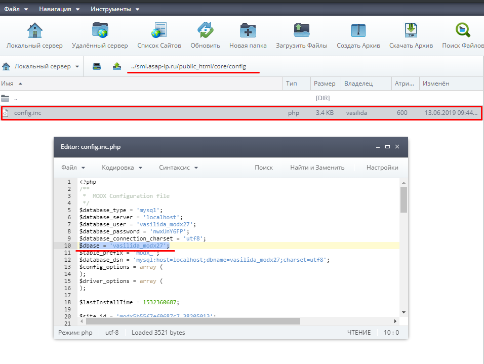

Попав в "phpMyAdmin", сразу перейдем в раздел "Экспорт"

Здесь ничего не нужно менять, просто нажимаем "Вперед"
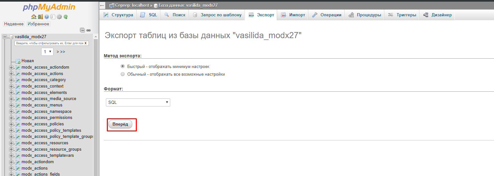

После этого начинается скачивание бэкапа базы данных.

## Второй этап: подготовка места куда будет перенесен сайт.
#### *все действия происходят на хостинге заказчика*

Перейдем в административную панель хостинга.
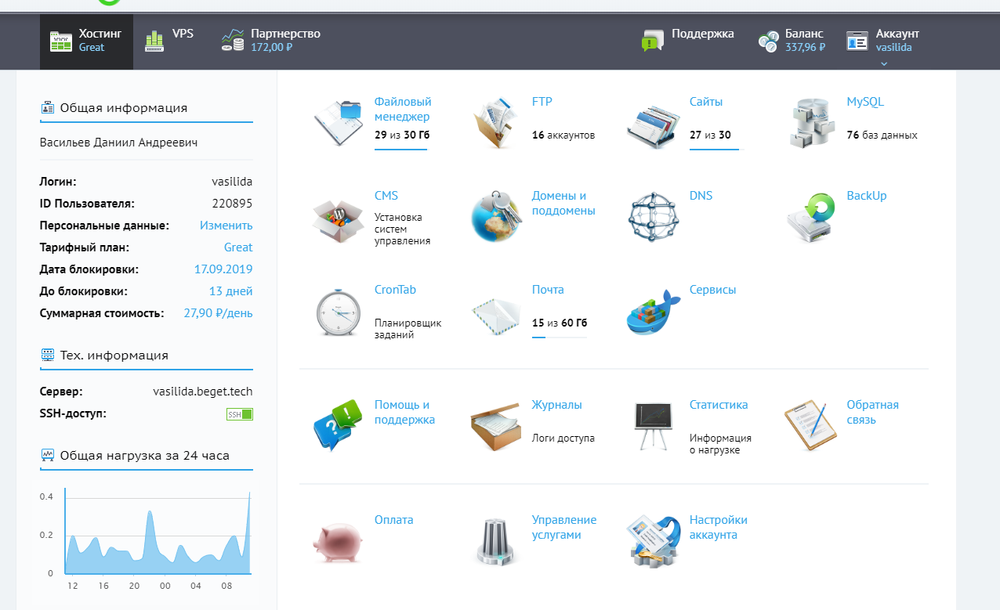

#### Если сайт уже создан, то пропускаем следующий шаг.

Создадим новый сайт, перейдем в раздел "домены и поддомены". И назовем его, например test.asap-lp.ru.
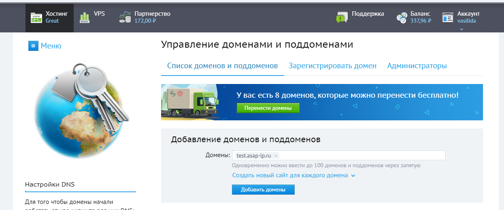

Сайт успешно был создан.
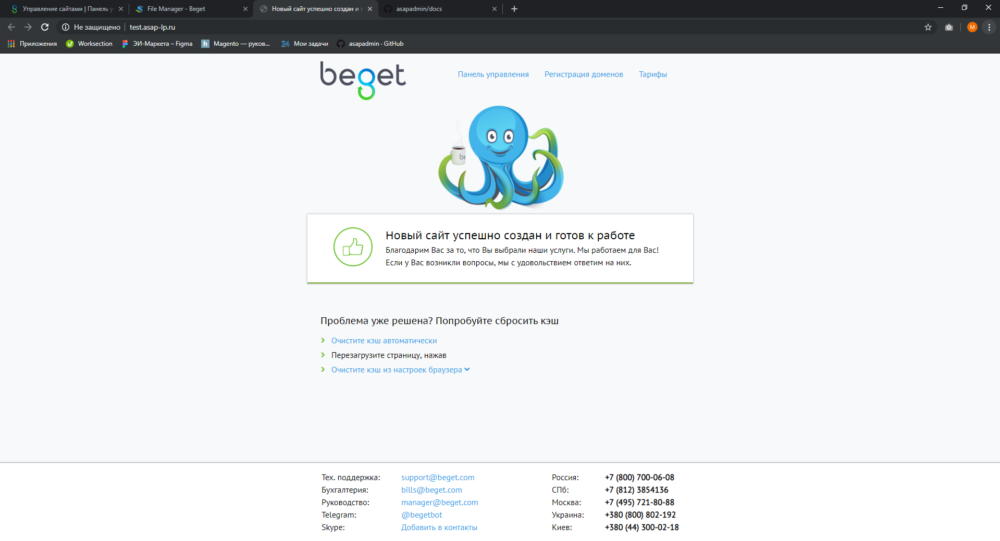

#### Также, если база данных уже была создана, то следующий шаг тоже пропускаем.

Далее создадим базу данных для нового сайта. Переходим в раздел "MySQL" и назовем ее "vasilida_test" с аналогичным паролем. 

#### *ВНИМАНИЕ! Важно запомнить логин и пароль от базы данных.

#### *ВНИМАНИЕ! Важно не указывать для базы данных пароль, совпадающий с логином, я так сделал в качестве примера.

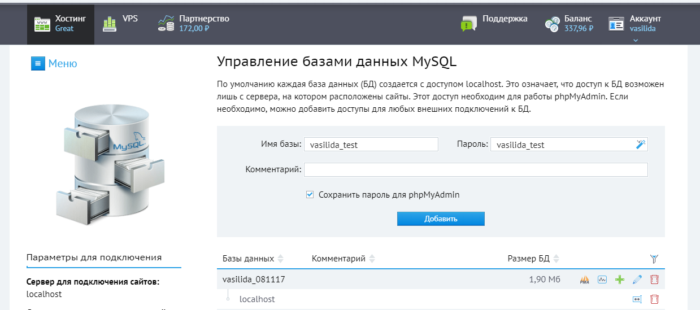

Теперь мы подготовили место куда будем переносить сайт.

# Третий этап: сам перенос сайта.
#### *все действия происходят на хостинге заказчика*

Вернемся в файловый менеджер, перейдем в папку с сайтом, который мы подготовили. В этом примере это "

	../test.asap-lp.ru

где "test.asap-lp.ru" - имя сайта. Загрузим в эту папку архив нашего сайта, который мы скачали в первом этапе.
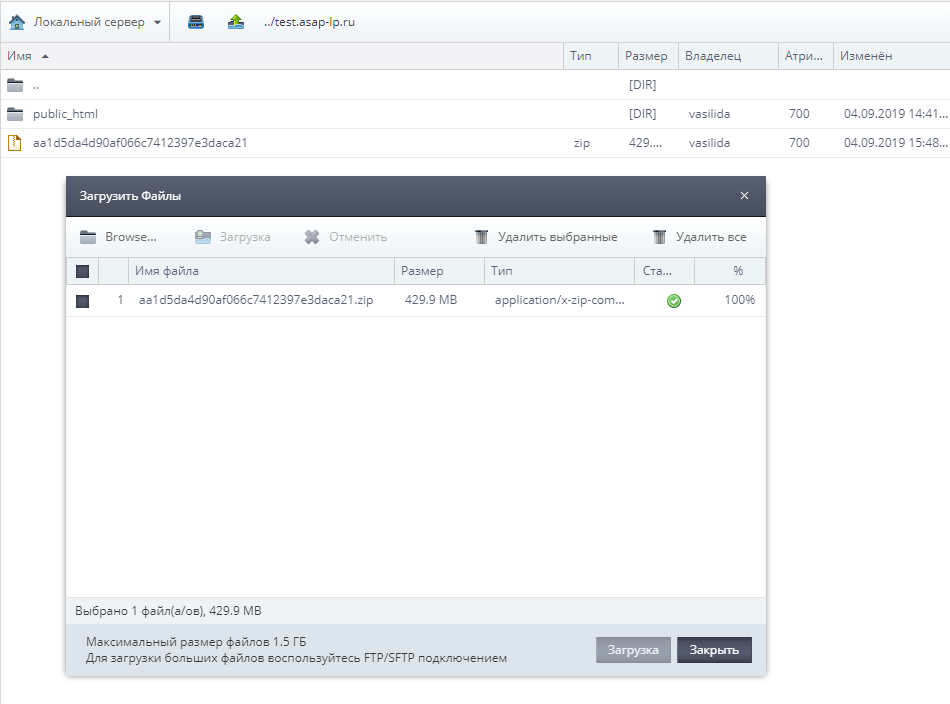

Распакуем этот архив.
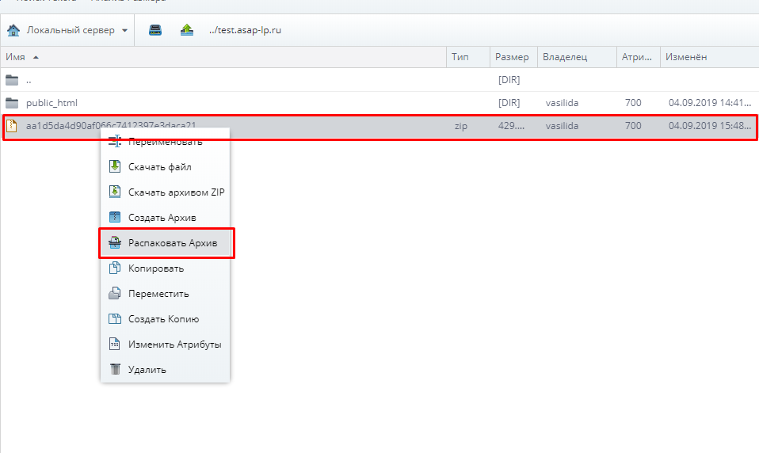

Ничего не меняем, нажимаем "ОК"
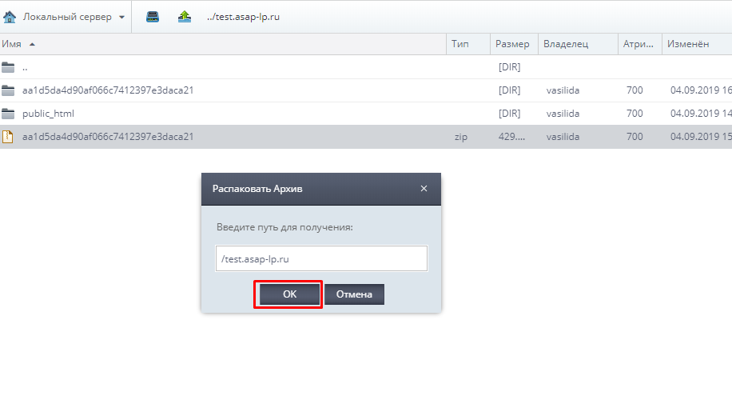

После завершения распаковки, папку "public_html" и архив можно удалить.
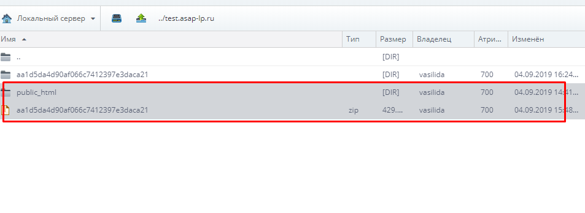

Далее зайдем в папку с распаковавшимся архивом и переместим из него папку "public_html" в корень сайта.
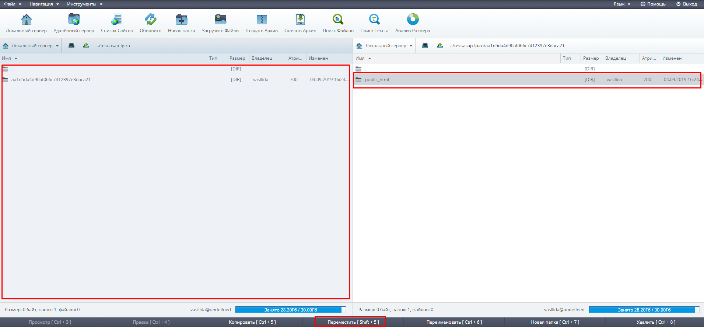

После этого папку арихива тоже нужно удалить.
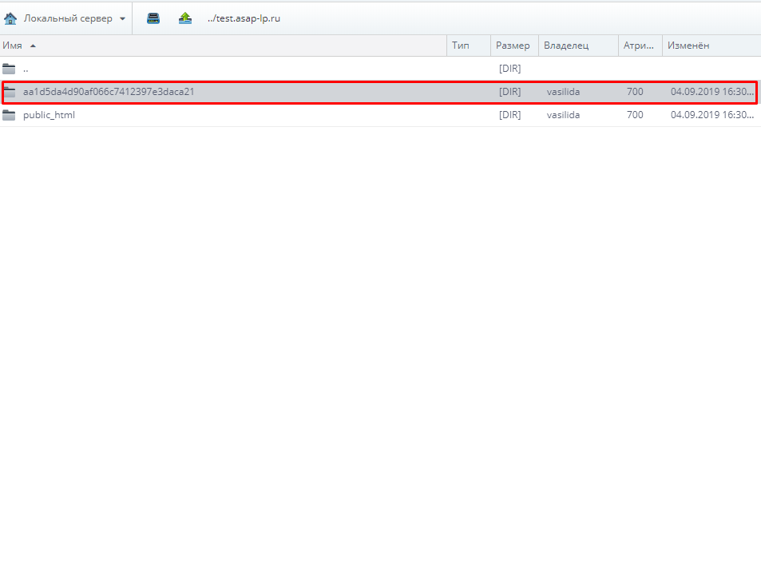

Теперь необходимо поменять файлы конфигов сайта. Их всего 4, они находятся по путям:

	1.	public_html/config.core.php
	2.	public_html/connectors/config.core.php
	3.	public_html/core/config/config.inc.php
	4.	public_html/manager/config.core.php

Начнем с 1-го:
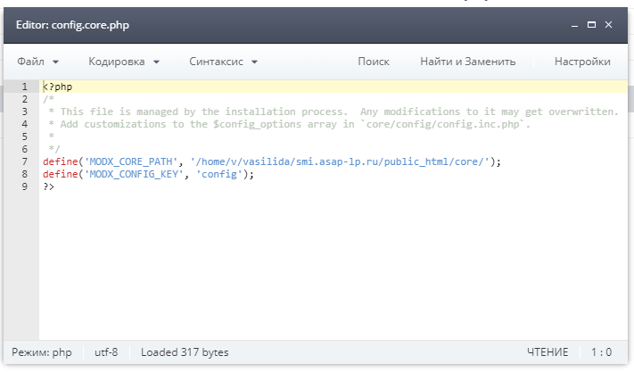

В нем необходимо изменить 7-ую строку кода. 
В ней меняем до "public_html":

	define('MODX_CORE_PATH', '/home/v/vasilida/smi.asap-lp.ru/public_html...
	
На:

	define('MODX_CORE_PATH', '/home/v/vasilida/test.asap-lp.ru/public_html...

Разберем подробнее:
1.	"v" - это первая буква имени администратора хостинга, иначе говоря - логина.
2. "vasilida" - сам логин администратора хостинга
3. "smi.asap-lp.ru" - файловая директория, в которой был создан сайт. (обычно именуется именем адреса сайта).

В итоге получим следующее:
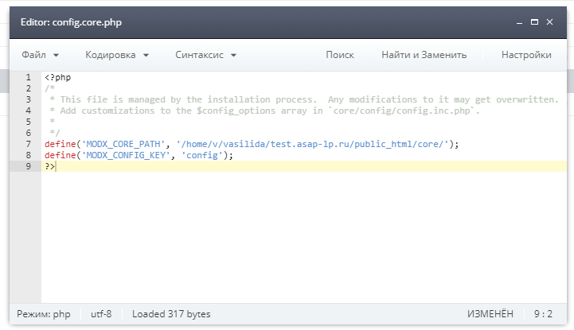

В пунктах 2 и 4 нужно произвести аналогичные изменения, поэтому опустим их.

Перейдем к 3-му пункту:
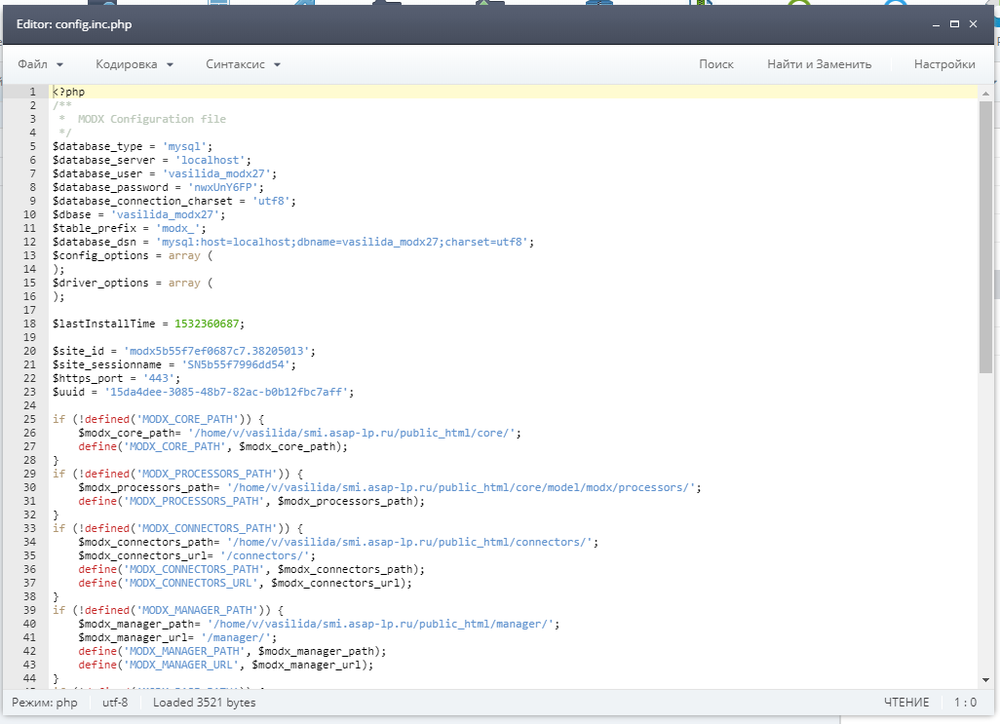

Внесем изменения касающиеся базы данных:

В строке 7:

	$database_user = 'vasilida_modx27';

Меняем на:

	$database_user = 'vasilida_test';

#### *пользователя и имя базы данных обычно совпадают, мы создавали базу с именем "vasilida_test", поэтому в имени пользователя указываем тоже самое.

В строке 8:

	$database_password = 'nwxUnY6FP';

Меняем на:

	$database_password = 'vasilida_test';

#### *мы создавали базу с именем "vasilida_test", и таким же паролем, поэтому указываем его.

В строке 10:

	$dbase = 'vasilida_modx27';

Меняем на:

	$dbase = 'vasilida_test';

#### *здесь указываем имя базы данных.

В строке 12:

	$database_dsn = 'mysql:host=localhost;dbname=vasilida_modx27;charset=utf8';

Меняем на:

	$database_dsn = 'mysql:host=localhost;dbname=vasilida_test;charset=utf8';

#### *здесь тоже указываем имя базы данных.

Далее в строках 26, 30, 34, 40, 46, 78 меняем путь до "public_html":

	'/home/v/vasilida/smi.asap-lp.ru/public_html...

На:

	'/home/v/vasilida/test.asap-lp.ru/public_html...

А в строках 62, 65 - указываем адрес сайта:

	62| $http_host='smi.asap-lp.ru';
	65| $http_host= array_key_exists('HTTP_HOST', $_SERVER) ? htmlspecialchars($_SERVER['HTTP_HOST'], ENT_QUOTES) : 'smi.asap-lp.ru';
Меняем на:

	62| $http_host='test.asap-lp.ru';
	65| $http_host= array_key_exists('HTTP_HOST', $_SERVER) ? htmlspecialchars($_SERVER['HTTP_HOST'], ENT_QUOTES) : 'test.asap-lp.ru';

В итоге получим:
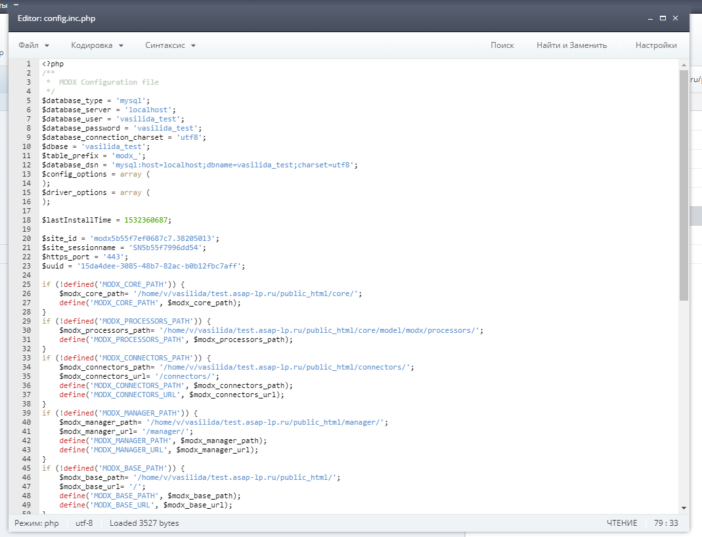
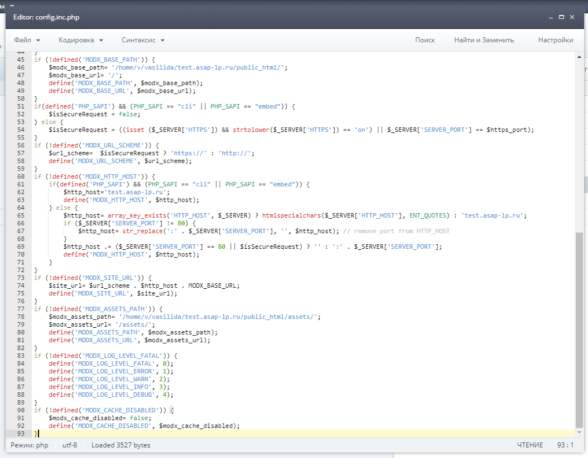

Сделаем последнее действие в файловом менеджере - нужно удалить папку 

	cache

по пути 

	../test.asap-lp.ru/public_html/core

Теперь нужно перенести базу данных. Зайдем в "phpMyAdmin" новой базы, в нашем случае "vasilida_test":

Сразу перейдем в раздел "Импорт":

Далее выберем тот бекап базы, который ранее скачивали и ничего не меняя нажимаем "Вперед"
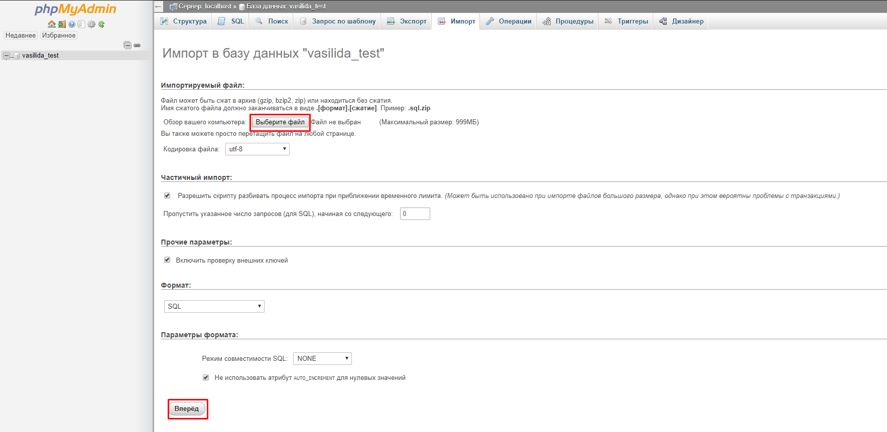

После этого необходимо подождать некоторое время, пока база не будет импортирована.

# Проверка и настройка сайта
## Проверка
Теперь можно зайти на новый сайт и убедиться, что он работает:

А также проверим административную панель:
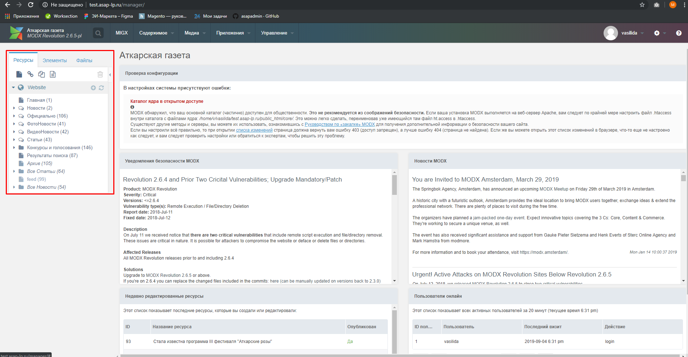

Как видно, ресурсы слева в панели подгрузились, значит перенос прошел успешно.

## Настройка
### Индексация
Если сайт был перенесен на наш хостинг:
* Закрыть сайт от индексации файл `robots.txt`

		User-agent: *
		Disallow: /
		User-agent: Yandex
		Disallow: /
		User-agent: Googlebot
		Disallow: /

Если сайт был перенесен на хостинг заказчика
* Открыть сайт для индексации файл `robots.txt`

		User-agent: *
		Allow: /
		User-agent: Yandex
		Allow: /
		User-agent: Googlebot
		Allow: /

### Формы
Необходимо поменять почту на которую приходят письма на почту заказчика.
